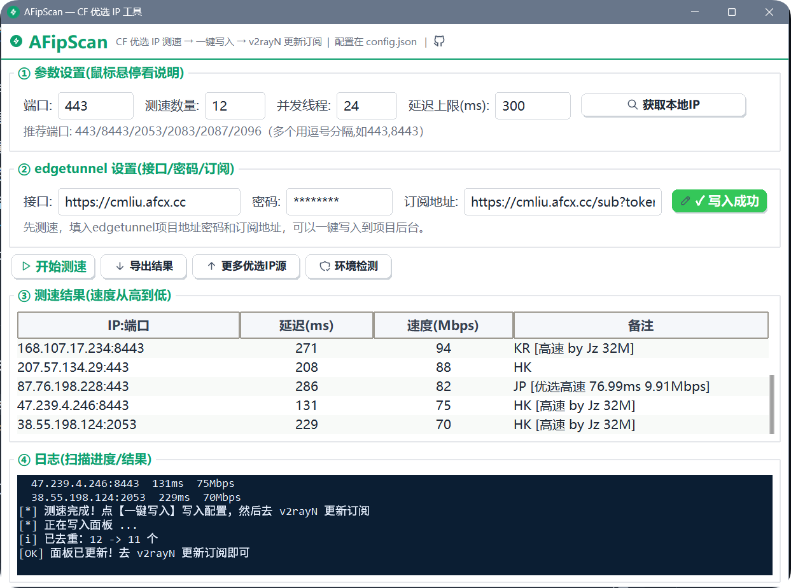

# ⚡ AFipScan — Cloudflare 优选 IP 测速工具

> 在你本地电脑上实时测速，找出对**你当前网络**最快、且能连上你 edgetunnel 项目的 Cloudflare IP，然后**一键写入面板**，再更新 v2rayN 订阅即可使用。



## ✨ 特性

- 🚀 **本地实时测速**：TCP + TLS 握手测延迟，再对达标 IP 实测**下载速度**，结果按速度从高到低排序（YouTube 高码率不再卡顿）
- 🖥️ **一键写入面板**：把优选结果自动写入 edgetunnel（Pages）项目后台，无需手动复制
- 🎯 **多端口支持**：支持 `443, 8443, 2053, 2083, 2087, 2096` 等端口，可自定义、可多选
- 📁 **配置与程序分离**：所有设置都在 `config.json`，改配置无需重新打包
- 🖱️ **右键快捷操作**：结果表格右键「复制优选IP」、日志窗口右键「清空日志」
- 🧭 **一键环境检测**：检查系统代理、公网连通、本地代理、面板可达、候选源、防火墙
- 🌐 **获取本地 IP**：一键判断当前是本地直连还是开了代理（直连=绿，代理=红）
- 📥 **优选源管理**：默认启用 3 个高速优选源（含速度标注），一键「获取更多源地址」可追加更多候选源（全量/多运营商/韩国高分），全部去重
- 📄 **导出结果**：一键导出测速结果为文本文件

## 🚀 快速开始

### 方式一：直接下载 exe（推荐）

1. 在 [Releases](../../releases) 下载 `AFipScan.exe`
2. 双击运行（未签名，若提示"未知发布者"，点"仍要运行"）
3. 点【开始测速】→ 约 30~60 秒出结果（延迟测速 + 带宽实测，运行中再点一次可停止）
4. 点【一键写入】→ 自动写入面板 → 去 v2rayN 更新订阅

### 方式二：从源码运行

```bash
# 需要 Python 3.10+
pip install -r requirements.txt
python main.py
```

> `ttkbootstrap` 用于更现代的浅色界面主题；即使没装，程序也会自动回退到系统自带主题，不影响功能。

## ⚙️ 配置说明（config.json）

程序同目录下的 `config.json` 保存所有配置，用记事本打开修改保存即可，无需重新打包。删除该文件后程序会自动生成一份默认配置。

| 字段 | 说明 |
| --- | --- |
| `sni` | 测速握手用的域名（Cloudflare 托管域名即可，一般不用改） |
| `panel` | edgetunnel 面板地址，也可在软件界面里填写 |
| `admin_password` | 面板登录密码，也可在软件界面里填写 |
| `subscription_url` | 订阅链接（界面里双击框内自动复制） |
| `port_default` | 默认测速端口，与面板里"指定端口"保持一致 |
| `proxy_url` | 本地代理地址（环境检测 / 判断代理出口用） |
| `candidate_urls` | 自动拉取的候选 IP 列表网址（每行一个，可增删） |
| `builtin_ips` | 内置兜底候选 IP（候选列表拉取失败时用） |

> 在软件界面里填写的「接口 / 密码 / 订阅地址」以及测速参数，会在关闭软件时自动写回 `config.json`，下次启动自动读取。

## 🎛️ 参数说明

| 参数 | 说明 |
| --- | --- |
| 端口 | 默认 443，支持多端口逗号分隔，如 `443,8443,2053,2083,2087,2096` |
| 测速数量 | 保留前 N 个最快的 IP（默认 12） |
| 并发线程 | 同时测速多少个 IP（默认 24，网络卡可调小） |
| 延迟上限 | 只保留低于该延迟的 IP（默认 300ms，扫不到可调 600） |

## 🖱️ 界面功能

- **开始测速 / 停止**：运行中按钮变红显示"停止"，再点一次可停止
- **获取本地 IP**：判断当前是本地直连（绿）还是开了代理（红）。开代理时测到的优选 IP 不准，建议关闭代理再测
- **环境检测**：一键检查配置 / 系统代理 / 公网 / 本地代理 / 面板 / 候选源 / 防火墙
- **更多优选 IP 源**：勾选要用的源（默认已选 3 个高速优选源），点「获取更多源地址」可追加全量/多运营商/韩国高分等更多源；勾选后点保存
- **一键写入**：把测速结果写入 edgetunnel 面板（写入前自动按 IP 查重，避免重复节点；需先填接口 / 密码 / 订阅）
- **导出结果**：把测速结果保存为文本
- **右键结果表格** → 复制优选 IP（纯 `IP:端口`，每行一个）
- **右键日志窗口** → 清空日志
- **双击订阅地址框** → 复制订阅链接

## 🛠️ 技术栈

- Python 3 + `tkinter` / `ttkbootstrap`
- 纯标准库实现 TCP + TLS 延迟测速、Cloudflare 官方测速文件带宽实测（HTTP/1.1 + 浏览器 UA）与面板写入，无后端依赖
- 图标：Tabler 图标库（base64 内嵌，打包后无需外部文件）
- 打包：PyInstaller `--onefile --noconsole`

## ❓ 常见问题

**Q: 测速结果全是 -1 / 超时？**
先点【环境检测】，确认系统代理、公网、防火墙是否正常；如果开了代理，测到的结果会不准，建议关闭代理再测。

**Q: 换电脑/重装后配置还在吗？**
配置保存在 exe 同目录的 `config.json`，备份该文件即可迁移；删除后程序会生成默认配置。

**Q: 写入面板失败？**
确认「接口 / 密码」正确、网络能访问该面板，且本机可直连（不要开代理）。

## 📄 免责声明

本项目仅供学习与个人使用。请遵守 Cloudflare 服务条款与所在地区法律法规，使用者自行承担相关责任。
